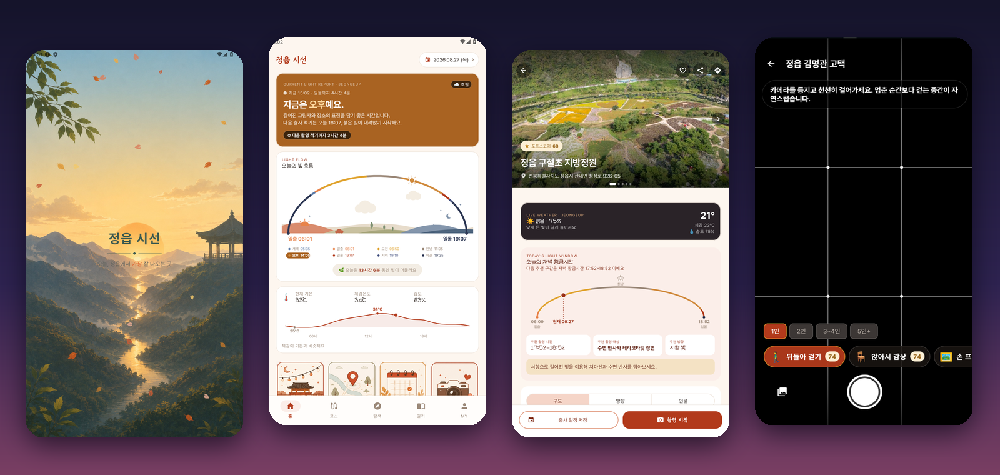
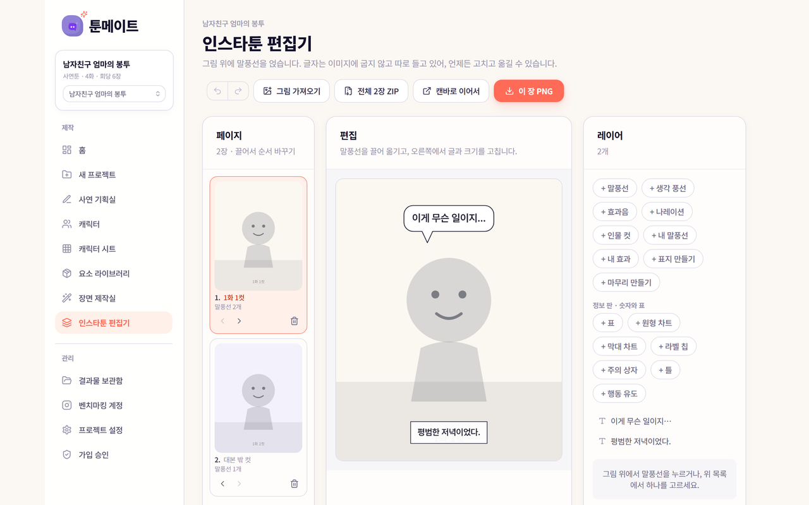
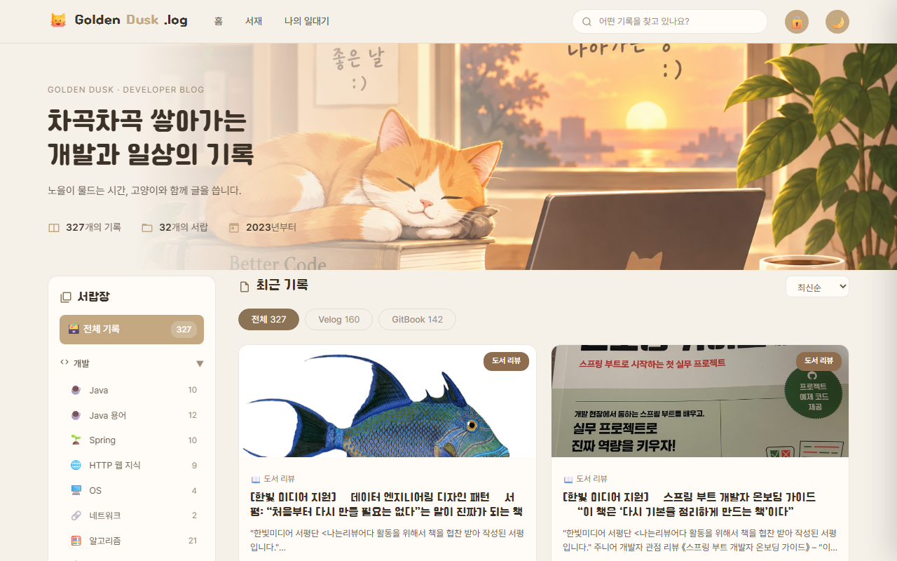
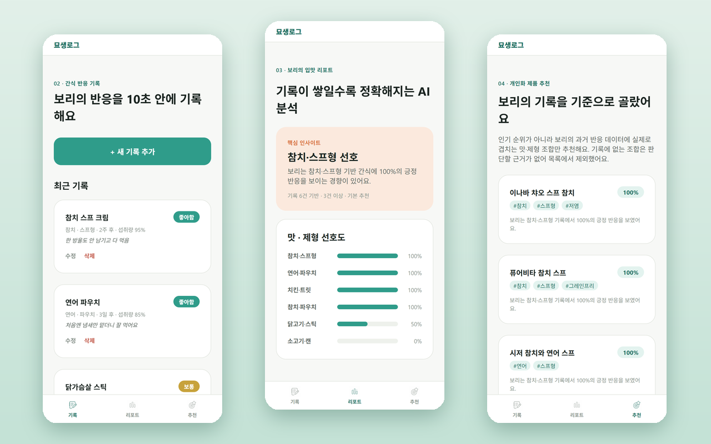
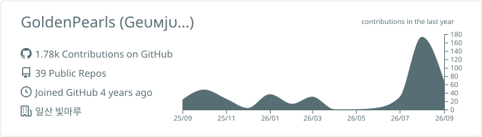
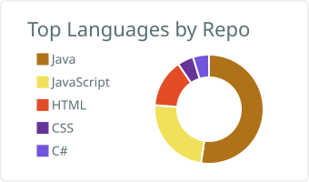
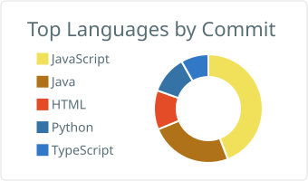
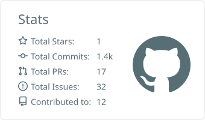

  
  
  
  
  
  

## 🐇 About Me

혼자 나아가는 것이 아닌, **같이 나아가기 위해 소통하고 기록하여 공유하는** 개발자입니다.

- 🏢 **SI 회사 SM LMS 팀**에서 Spring · MyBatis · MariaDB로 LMS를 운영·개발하는 **3년차 백엔드 개발자**예요.
- 🤖 퇴근 후에는 **AI로 반복 작업을 없애는 도구**를 만들어요. 인스타툰 제작, 블로그 초안, 북마크 분류, 콘텐츠 자동화까지 직접 쓰려고 만든 서비스가 10개가 넘어요.
- 🌱 **OOP · JPA · DDD**를 꾸준히 공부하고, 이펙티브 자바 · HTTP 완벽 가이드 · 톰캣 최종분석 같은 **공개 스터디**에 매 시즌 참여해요.
- 📑 **DFS 공부방식**을 좋아해요. "왜?"에 대한 답이 나올 때까지 끝까지 파고듭니다.
- ✍️ velog에 **230편 넘는 글**을 썼고, 면접 후기 글로 많은 공감을 받았어요.
- ☕ 부족한 도메인 지식은 **커피챗**으로 채워 가는 중입니다. 언제든 연락 주세요!
- 🐈 고양이를 좋아해서 고양이 기록 서비스도 두 번이나 만들었어요.

 

## 🛠 Tech Stack

  <b>Backend</b> 
   
  
  
  
    
  <b>Database · Infra</b> 
   
  
    
  <b>Frontend</b> 
  
    
  <b>AI · Tools</b> 
  
  
  
  
   
  

## 🚀 Featured Projects

<table>
<tr>
<td colspan="3" valign="top">

<h3 align="center">📸 정읍 시선 (PicView)</h3>

<i>"지금 정읍에서, 어디를 어떻게 담을까"</i>

한국천문연구원 일출·일몰 + 기상청 실황·예보 + 촬영지의 방위를 하나로 계산해 
<b>지금이 촬영 적기인지, 어디서 어떤 포즈로 찍을지</b>까지 알려 주는 지역 특화 출사 안내 앱이에요. 
관광 앱이 "어디를 갈까"에서 멈출 때, <b>"언제 가야 사진이 잘 나오는지"</b>를 답합니다.

<a href="https://github.com/Young-Seok-Kim/pic-view">📦 github.com/Young-Seok-Kim/pic-view</a>

</td>
</tr>
<tr>
<td width="33%" valign="top">

<h3>🎨 툰메이트</h3>
사연을 넣으면 AI가 각색하고, 캐릭터를 유지한 채 컷을 그려 <b>인스타툰으로 완성</b>해 주는 웹 서비스.  

 <a href="https://toonmate.vercel.app">🔗 toonmate.vercel.app</a>
</td>
<td width="33%" valign="top">

<h3>🌇 황혼의 서재</h3>
개발 · 회고 · 일상을 기록하는 <b>나만의 블로그</b>. 차곡차곡 쌓아 가는 기록의 집이에요.  

 <a href="https://goldendusk-blog.vercel.app">🔗 goldendusk-blog.vercel.app</a>
</td>
<td width="33%" valign="top">

<h3>🐈 묘생로그</h3>
"우리 고양이를 가장 잘 아는 AI 집사". 간식 반응을 10초 만에 기록하면 <b>기록이 쌓일수록 정확해지는 취향 리포트와 추천</b>을 받아요.  

 🔒 비공개 저장소
</td>
</tr>
</table>

<b>🧰 그 밖에 만든 것들 (펼치기)</b>

 

| 프로젝트 | 한 줄 소개 | 스택 |
|---|---|---|
| 📝 [블로그 초안 자동 작성](https://naver-blog-draft-app.vercel.app) | Claude · GPT · Gemini 중 골라 쓰는 네이버 블로그 초안 생성기 | JavaScript |
| 🍜 [썸네일 메이커](https://thumbnail-maker-lime.vercel.app) | 블로그 일상 글에 어울리는 감성 썸네일 제작기 | JavaScript · Vercel |
| 🔖 [북마크 허브](https://bookmark-hub-theta.vercel.app) | 쓰레드 · X · 인스타 북마크 2,262개를 모아 자동 분류하는 대시보드 | Python · Vercel |
| ✈️ 콘텐츠 오토파일럿 | 트렌드 수집 → Slack 승인 → 블로그 글 · 인스타툰 자동 생성 | FastAPI · Docker · Slack |
| 🛒 [쿠팡 콘텐츠 자동화](https://coupang-content-automation.vercel.app) | 제휴 링크 + AI 문구 + 이미지 · 영상 콘텐츠 자동 생성 | JavaScript |
| 📈 [Rank Pulse](https://github.com/GoldenPearls/rank-pulse) | 키워드 검색량 · 경쟁도 · 블로그 노출 순위 추적 도구 | TypeScript · Vercel |
| 🤝 네이버 이웃 관리 봇 | 로컬 AI 댓글 초안 · 공감 · 서로이웃 신청 반자동화 | Python |
| 🐾 [Meow Diary](https://github.com/GoldenPearls/meow-diary) | 고양이 건강 · 식단 · 접종 · 병원 기록 사이트 | HTML · JS |
| 🛡 [mini-waf](https://github.com/GoldenPearls/mini-waf) | SQLi · XSS · Path Traversal을 탐지 · 차단하는 미니 웹 방화벽 | PHP CI4 · PostgreSQL |
| 🎪 [Festibook](https://github.com/GoldenPearls/festibook) | 멀티캠퍼스 KDT 팀 프로젝트 | JavaScript |

링크가 없는 프로젝트는 비공개 저장소예요.

## 📚 Study

<b>함께한 공개 스터디 (펼치기)</b>

 

| 시기 | 스터디 |
|---|---|
| 2025 하반기 | [알고리즘 스터디 시즌 6](https://github.com/GoldenPearls/algorithms-with-java-study) · [HTTP 완벽 가이드](https://github.com/GoldenPearls/2025-http-study) |
| 2025 상반기 | [한 권으로 읽는 컴퓨터 구조와 프로그래밍](https://github.com/GoldenPearls/2025-Architecture-Programming-Study) · [자바카페 리눅스 구조](https://github.com/GoldenPearls/2025-linux-for-beginner) · [톰캣 최종분석](https://github.com/GoldenPearls/How-Tomcat-Works-Study) |
| 2024 | [이펙티브 자바](https://github.com/GoldenPearls/2024-effective-java) · [Rust Book (잇츠 우먼)](https://github.com/GoldenPearls/Rust-Book-Study) |
| 꾸준히 | [CS 공부](https://github.com/GoldenPearls/study_cs) · [알고리즘 · 자료구조](https://github.com/GoldenPearls/Algorithm-Data-Structure) · [독서 기록](https://github.com/GoldenPearls/read_book) |

## ✍️ Latest Velog Posts

<!-- BLOG-POST-LIST:START -->
- [[한빛 미디어 지원] 《데이터 엔지니어링 디자인 패턴》 서평: “처음부터 다시 만들 필요는 없다”는 말이 진짜가 되는 책](https://velog.io/@prettylee620/%ED%95%9C%EB%B9%9B-%EB%AF%B8%EB%94%94%EC%96%B4-%EC%A7%80%EC%9B%90-%E3%80%8A%EB%8D%B0%EC%9D%B4%ED%84%B0-%EC%97%94%EC%A7%80%EB%8B%88%EC%96%B4%EB%A7%81-%EB%94%94%EC%9E%90%EC%9D%B8-%ED%8C%A8%ED%84%B4%E3%80%8B-%EC%84%9C%ED%8F%89-%EC%B2%98%EC%9D%8C%EB%B6%80%ED%84%B0-%EB%8B%A4%EC%8B%9C-%EB%A7%8C%EB%93%A4-%ED%95%84%EC%9A%94%EB%8A%94-%EC%97%86%EB%8B%A4%EB%8A%94-%EB%A7%90%EC%9D%B4-%EC%A7%84%EC%A7%9C%EA%B0%80-%EB%90%98%EB%8A%94-%EC%B1%85) 2026.03.02
- [[한빛 미디어 지원] 《스프링 부트 개발자 온보딩 가이드》 – “이 책은 ‘다시 기본을 정리하게 만드는 책’이다”](https://velog.io/@prettylee620/%ED%95%9C%EB%B9%9B-%EB%AF%B8%EB%94%94%EC%96%B4-%EC%A7%80%EC%9B%90-%E3%80%8A%EC%8A%A4%ED%94%84%EB%A7%81-%EB%B6%80%ED%8A%B8-%EA%B0%9C%EB%B0%9C%EC%9E%90-%EC%98%A8%EB%B3%B4%EB%94%A9-%EA%B0%80%EC%9D%B4%EB%93%9C%E3%80%8B-%EC%9D%B4-%EC%B1%85%EC%9D%80-%EB%8B%A4%EC%8B%9C-%EA%B8%B0%EB%B3%B8%EC%9D%84-%EC%A0%95%EB%A6%AC%ED%95%98%EA%B2%8C-%EB%A7%8C%EB%93%9C%EB%8A%94-%EC%B1%85%EC%9D%B4%EB%8B%A4) 2025.12.26
- [[이모저모] 알고리즘을 잘하는 방법, 협업을 잘하는 방법 등 난노와 피자챗 파티 후기&lpar;feat. 운동없는 운동팀, 이직없는 이직팀&rpar;](https://velog.io/@prettylee620/%EC%9D%B4%EB%AA%A8%EC%A0%80%EB%AA%A8-%EC%95%8C%EA%B3%A0%EB%A6%AC%EC%A6%98%EC%9D%84-%EC%9E%98%ED%95%98%EB%8A%94-%EB%B0%A9%EB%B2%95-%ED%98%91%EC%97%85%EC%9D%84-%EC%9E%98%ED%95%98%EB%8A%94-%EB%B0%A9%EB%B2%95-%EB%93%B1-%EB%82%9C%EB%85%B8%EC%99%80-%ED%94%BC%EC%9E%90%EC%B1%97-%ED%8C%8C%ED%8B%B0-%ED%9B%84%EA%B8%B0feat.-%EC%9A%B4%EB%8F%99%EC%97%86%EB%8A%94-%EC%9A%B4%EB%8F%99%ED%8C%80-%EC%9D%B4%EC%A7%81%EC%97%86%EB%8A%94-%EC%9D%B4%EC%A7%81%ED%8C%80) 2025.10.28
- [HTTP의 커넥션 관리와 TCP 3-handshake](https://velog.io/@prettylee620/HTTP%EC%9D%98-%EC%BB%A4%EB%84%A5%EC%85%98-%EA%B4%80%EB%A6%AC%EC%99%80-TCP-3-handshake) 2025.10.11
- [[한빛미디어 지원] 할루시네이션을 줄여주는 프롬프트 엔지니어링 책 리뷰 - o1-pro vs Perplexity, 그리고 RAG — LLM의 진화와 프롬프트 설계](https://velog.io/@prettylee620/%ED%95%9C%EB%B9%9B%EB%AF%B8%EB%94%94%EC%96%B4-%EC%A7%80%EC%9B%90-%ED%95%A0%EB%A3%A8%EC%8B%9C%EB%84%A4%EC%9D%B4%EC%85%98%EC%9D%84-%EC%A4%84%EC%97%AC%EC%A3%BC%EB%8A%94-%ED%94%84%EB%A1%AC%ED%94%84%ED%8A%B8-%EC%97%94%EC%A7%80%EB%8B%88%EC%96%B4%EB%A7%81-%EC%B1%85-%EB%A6%AC%EB%B7%B0-o1-pro-vs-Perplexity-%EA%B7%B8%EB%A6%AC%EA%B3%A0-RAG-LLM%EC%9D%98-%EC%A7%84%ED%99%94%EC%99%80-%ED%94%84%EB%A1%AC%ED%94%84%ED%8A%B8-%EC%84%A4%EA%B3%84) 2025.10.08<!-- BLOG-POST-LIST:END -->

<a href="https://velog.io/@prettylee620">👉 velog에서 더 보기</a>

## 📊 GitHub Stats

  

  
  
  

  

  <picture>
    <source media="(prefers-color-scheme: dark)" srcset="https://raw.githubusercontent.com/GoldenPearls/GoldenPearls/output/github-snake-dark.svg"/>
    
  </picture>

## 📫 Contact

- 📄 포트폴리오 · 이력서: [랠릿](https://www.rallit.com/resumes/6107@prettylee620)
- ✉️ 메일: [prettylee620@gmail.com](mailto:prettylee620@gmail.com)
- ✏️ 예전 기록: [티스토리](https://geumjulee.tistory.com/)

