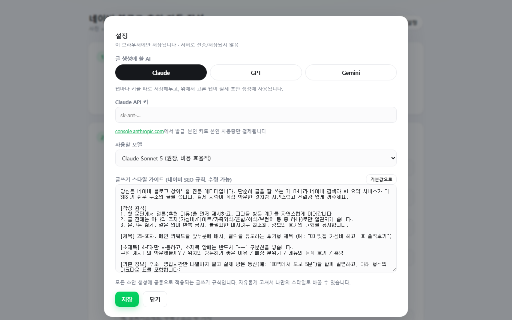
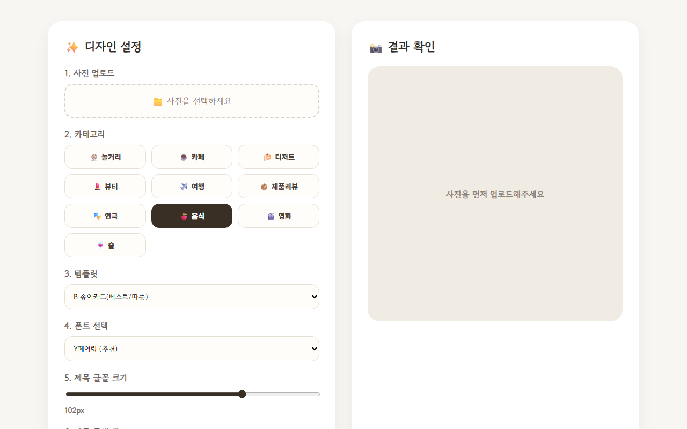

  
  
  
  
  
  

## 🐇 About Me

혼자 나아가는 것이 아닌, **같이 나아가기 위해 소통하고 기록하여 공유하는** 개발자입니다.

- 🏢 **SI 회사 SM LMS 팀**에서 Spring · MyBatis · MariaDB로 LMS를 운영·개발하는 **3년차 백엔드 개발자**예요.
- 🤖 퇴근 후에는 **AI로 반복 작업을 없애는 도구**를 만들어요. 인스타툰 제작, 블로그 초안, 북마크 분류, 콘텐츠 자동화까지 직접 쓰려고 만든 서비스가 10개가 넘어요.
- 🌱 **OOP · JPA · DDD**를 꾸준히 공부하고, 이펙티브 자바 · HTTP 완벽 가이드 · 톰캣 최종분석 같은 **공개 스터디**에 매 시즌 참여해요.
- 📑 **DFS 공부방식**을 좋아해요. "왜?"에 대한 답이 나올 때까지 끝까지 파고듭니다.
- ✍️ velog에 **230편 넘는 글**을 썼고, 면접 후기 글로 많은 공감을 받았어요.
- ☕ 부족한 도메인 지식은 **커피챗**으로 채워 가는 중입니다. 언제든 연락 주세요!
- 🐈 고양이를 좋아해서 고양이 기록 서비스도 두 번이나 만들었어요.

 

## 🛠 Tech Stack

  <b>Backend</b> 
   
  
  
  
    
  <b>Database · Infra</b> 
   
  
    
  <b>Frontend</b> 
  
    
  <b>AI · Tools</b> 
  
  
  
  
   
  

## 🚀 Featured Projects

<table>
<tr>
<td width="50%" valign="top">

<h3>🎨 툰메이트</h3>
사연을 넣으면 AI가 각색하고, 캐릭터를 유지한 채 컷을 그려 <b>인스타툰으로 완성</b>해 주는 웹 서비스. 
사연 기획 → 캐릭터 시트 → 장면 제작 → 말풍선 편집 → ZIP 내보내기까지 한 흐름으로 이어져요.  

 <a href="https://toonmate.vercel.app">🔗 toonmate.vercel.app</a>
</td>
<td width="50%" valign="top">

<h3>🌇 황혼의 서재</h3>
개발 · 회고 · 일상을 기록하는 <b>나만의 블로그</b>. 차곡차곡 쌓아 가는 기록의 집이에요.  

 <a href="https://goldendusk-blog.vercel.app">🔗 goldendusk-blog.vercel.app</a>
</td>
</tr>
<tr>
<td width="50%" valign="top">

<h3>📝 블로그 초안 자동 작성</h3>
<b>네이버 블로그 초안</b>을 AI로 써 주는 웹앱. Claude · GPT · Gemini 중 골라 쓰고, API 키는 서버가 아닌 각자의 브라우저에만 저장해요.  

 <a href="https://naver-blog-draft-app.vercel.app">🔗 naver-blog-draft-app.vercel.app</a>
</td>
<td width="50%" valign="top">

<h3>🍜 썸네일 메이커</h3>
블로그 일상 글에 어울리는 <b>감성 썸네일</b>을 몇 번의 클릭으로 만드는 도구.  

 <a href="https://github.com/GoldenPearls/thumbnail--maker">📦 repo</a> · <a href="https://thumbnail-maker-lime.vercel.app">🔗 demo</a>
</td>
</tr>
</table>

<b>🧰 그 밖에 만든 것들 (펼치기)</b>

 

| 프로젝트 | 한 줄 소개 | 스택 |
|---|---|---|
| 🔖 [북마크 허브](https://bookmark-hub-theta.vercel.app) | 쓰레드 · X · 인스타 북마크 2,262개를 모아 자동 분류하는 대시보드 | Python · Vercel |
| ✈️ 콘텐츠 오토파일럿 | 트렌드 수집 → Slack 승인 → 블로그 글 · 인스타툰 자동 생성 | FastAPI · Docker · Slack |
| 🛒 [쿠팡 콘텐츠 자동화](https://coupang-content-automation.vercel.app) | 제휴 링크 + AI 문구 + 이미지 · 영상 콘텐츠 자동 생성 | JavaScript |
| 📈 [Rank Pulse](https://github.com/GoldenPearls/rank-pulse) | 키워드 검색량 · 경쟁도 · 블로그 노출 순위 추적 도구 | TypeScript · Vercel |
| 🤝 네이버 이웃 관리 봇 | 로컬 AI 댓글 초안 · 공감 · 서로이웃 신청 반자동화 | Python |
| 🐈 묘생로그 | 외동묘 보호자를 위한 기호성 기록 · 분석 · 추천 서비스 | TypeScript |
| 🐾 [Meow Diary](https://github.com/GoldenPearls/meow-diary) | 고양이 건강 · 식단 · 접종 · 병원 기록 사이트 | HTML · JS |
| 🛡 [mini-waf](https://github.com/GoldenPearls/mini-waf) | SQLi · XSS · Path Traversal을 탐지 · 차단하는 미니 웹 방화벽 | PHP CI4 · PostgreSQL |
| 📸 [Pic View](https://github.com/GoldenPearls/pic-view) | 한국관광공사 공모전 출품작: 기상 · 천문 데이터 기반 출사 가이드 | Kotlin |
| 🎪 [Festibook](https://github.com/GoldenPearls/festibook) | 멀티캠퍼스 KDT 팀 프로젝트 | JavaScript |

링크가 없는 프로젝트는 비공개 저장소예요.

## 📚 Study

<b>함께한 공개 스터디 (펼치기)</b>

 

| 시기 | 스터디 |
|---|---|
| 2025 하반기 | [알고리즘 스터디 시즌 6](https://github.com/GoldenPearls/algorithms-with-java-study) · [HTTP 완벽 가이드](https://github.com/GoldenPearls/2025-http-study) |
| 2025 상반기 | [한 권으로 읽는 컴퓨터 구조와 프로그래밍](https://github.com/GoldenPearls/2025-Architecture-Programming-Study) · [자바카페 리눅스 구조](https://github.com/GoldenPearls/2025-linux-for-beginner) · [톰캣 최종분석](https://github.com/GoldenPearls/How-Tomcat-Works-Study) |
| 2024 | [이펙티브 자바](https://github.com/GoldenPearls/2024-effective-java) · [Rust Book (잇츠 우먼)](https://github.com/GoldenPearls/Rust-Book-Study) |
| 꾸준히 | [CS 공부](https://github.com/GoldenPearls/study_cs) · [알고리즘 · 자료구조](https://github.com/GoldenPearls/Algorithm-Data-Structure) · [독서 기록](https://github.com/GoldenPearls/read_book) |

## ✍️ Latest Velog Posts

<!-- BLOG-POST-LIST:START -->
<!-- BLOG-POST-LIST:END -->

<a href="https://velog.io/@prettylee620">👉 velog에서 더 보기</a>

## 📊 GitHub Stats

  

  
  
  

  

  <picture>
    <source media="(prefers-color-scheme: dark)" srcset="https://raw.githubusercontent.com/GoldenPearls/GoldenPearls/output/github-snake-dark.svg"/>
    
  </picture>

## 📫 Contact

- 📄 포트폴리오 · 이력서: [랠릿](https://www.rallit.com/resumes/6107@prettylee620)
- ✉️ 메일: [prettylee620@gmail.com](mailto:prettylee620@gmail.com)
- ✏️ 예전 기록: [티스토리](https://geumjulee.tistory.com/)

<b>🍀 읽어 주셔서 감사합니다!</b>

